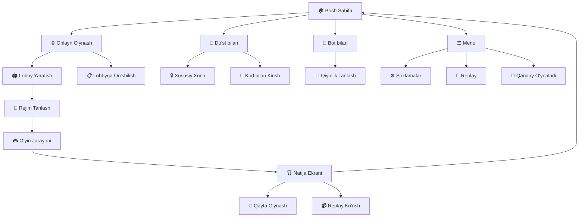
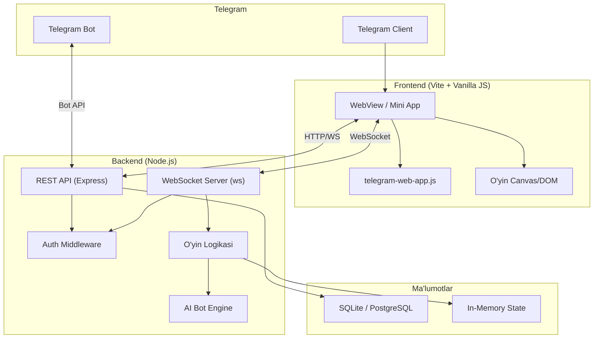

# 🎮 "To'siq Yo'l" — Telegram Mini App O'yin Loyihasi

> Quoridor asosidagi strategik stol o'yini — Telegram Mini App sifatida

## 📋 Loyiha Tavsifi

**"Wrong Way"** (wrongway.app) o'yinidan ilhomlangan, Quoridor qoidalariga asoslangan 1v1 strategik stol o'yini. O'yinchilar navbatma-navbat shoshqalarini (pawn) raqib tomoniga yetkazishga harakat qiladi, bunda yo'lni to'sish uchun devorlar (barricade) qo'yishi mumkin. Birinchi bo'lib raqib tomoniga yetgan o'yinchi g'alaba qozonadi.

**Asosiy til**: O'zbek tili 🇺🇿
**Platforma**: Telegram Mini App (WebView)
**Domen**: Mavjud (foydalanuvchi tomonidan taqdim etiladi)

---

## 🔍 Reference Tahlili (23 ta screenshot)

Rasmlarda aniqlangan barcha ekranlar va funksiyalar:

### Ekranlar Xaritasi



### Batafsil Ekran Tahlili

| # | Ekran | Tavsifi | Asosiy Elementlar |
|---|-------|---------|-------------------|
| 1 | **Bosh Sahifa** | O'yinning asosiy menyu sahifasi | Logo, slogan, onlayn foydalanuvchilar soni, 3 ta asosiy rejim |
| 2 | **Onlayn O'ynash** | Ochiq lobbylar ro'yxati | Lobby yaratish tugmasi, lobbylar kartasi (nom, vaqt, rejim), Join tugmasi |
| 3 | **Do'st bilan** | Xususiy xona | Private Lobby yaratish, 4 xonali kod kiritish, Join tugmasi |
| 4 | **Qiyinlik Tanlash** | Bot rejimi uchun | Easy/Normal/Hard, rangli indikatorlar |
| 5 | **Rejim Sozlash** | O'yin parametrlari | Duell/Race, 7×7/9×9, Timer (0/3/5 min), Blitz (10s), Devor soni |
| 6 | **O'yin Jarayoni** | Asosiy gameplay | Grid, shoshqalar, devorlar, timer, devor soni, emoji tugmalari |
| 7 | **G'alaba Ekrani** | O'yin tugadi (g'alaba) | 🏆 Kubok, confetti animatsiya, hisob, Rematch/Replay/Menu |
| 8 | **Mag'lubiyat** | O'yin tugadi (yutqazish) | 😢 Xafa emoji, hisob, Rematch/Replay/Menu |
| 9 | **Replay** | O'yinni qayta ko'rish | Qadam sanagich, progress bar, ▶/◀ tugmalari, devor ranglari |
| 10 | **Sozlamalar** | Mavzu va til | Light/Dark tema, Til tanlash, Vibratsiya toggle |
| 11 | **Login** | Hisobga kirish | Email/Password, Google login |

---

## 🏗️ Texnik Arxitektura

### Umumiy Arxitektura



### Texnologiya Stack

| Qatlam | Texnologiya | Sabab |
|--------|-------------|-------|
| **Frontend** | Vite + Vanilla JS + CSS | Tez, yengil, framework yukisiz |
| **O'yin Board** | HTML Canvas yoki CSS Grid | Responsive, touch-friendly |
| **Backend** | Node.js + Express | JavaScript ekosistema birligi |
| **WebSocket** | `ws` kutubxonasi | Real-time multiplayer |
| **Ma'lumotlar bazasi** | SQLite (boshlang'ich) → PostgreSQL | Sodda deploy, keyinchalik scale |
| **AI Bot** | Minimax + Alpha-Beta Pruning | Quoridor uchun optimal |
| **Deploy** | Foydalanuvchining domeni | HTTPS shart |

---

## 📁 Loyiha Strukturasi

```
d:\TelegramGame\
├── client/                          # Frontend (Vite)
│   ├── index.html                   # Asosiy HTML
│   ├── vite.config.js               # Vite konfiguratsiya
│   ├── public/
│   │   ├── favicon.ico
│   │   └── assets/
│   │       ├── sounds/              # O'yin ovozlari
│   │       └── images/              # Rasmlar, ikonkalar
│   └── src/
│       ├── main.js                  # Entry point
│       ├── styles/
│       │   ├── index.css            # Global stillar, CSS tokens
│       │   ├── menu.css             # Menyu stillari
│       │   ├── game.css             # O'yin taxtasi stillari
│       │   ├── modals.css           # Modal/popup stillar
│       │   └── animations.css       # Animatsiyalar
│       ├── core/
│       │   ├── telegram.js          # Telegram SDK wrapper
│       │   ├── router.js            # SPA router (hash-based)
│       │   ├── storage.js           # CloudStorage / localStorage
│       │   └── websocket.js         # WebSocket client + reconnect
│       ├── game/
│       │   ├── board.js             # O'yin taxtasi rendering (Canvas/DOM)
│       │   ├── logic.js             # Client-side o'yin qoidalari
│       │   ├── pieces.js            # Shoshqa va devor elementlari
│       │   ├── timer.js             # Timer logikasi
│       │   ├── animations.js        # O'yin animatsiyalari
│       │   └── replay.js            # Replay tizimi
│       ├── screens/
│       │   ├── home.js              # Bosh sahifa
│       │   ├── online.js            # Onlayn o'ynash (lobby)
│       │   ├── friend.js            # Do'st bilan o'ynash
│       │   ├── bot.js               # Bot bilan o'ynash
│       │   ├── mode-select.js       # Rejim tanlash
│       │   ├── game-screen.js       # O'yin ekrani
│       │   ├── result.js            # Natija ekrani
│       │   ├── replay-screen.js     # Replay ekrani
│       │   └── settings.js          # Sozlamalar
│       ├── components/
│       │   ├── button.js            # Qayta foydalaniladigan tugma
│       │   ├── card.js              # Karta komponenti
│       │   ├── modal.js             # Modal dialog
│       │   ├── toast.js             # Xabar toast
│       │   └── emoji-picker.js      # Emoji reaksiya
│       └── i18n/
│           ├── uz.js                # O'zbek tili
│           └── en.js                # Ingliz tili (qo'shimcha)
│
├── server/                          # Backend
│   ├── package.json
│   ├── index.js                     # Server entry point
│   ├── config.js                    # Konfiguratsiya
│   ├── middleware/
│   │   └── auth.js                  # Telegram initData validatsiya
│   ├── routes/
│   │   ├── auth.js                  # /api/auth
│   │   ├── game.js                  # /api/game (tarix, statistika)
│   │   └── lobby.js                 # /api/lobby
│   ├── ws/
│   │   ├── handler.js               # WebSocket boshqaruvchi
│   │   ├── matchmaking.js           # Matchmaking logikasi
│   │   └── rooms.js                 # Xona boshqaruvi
│   ├── game/
│   │   ├── quoridor.js              # Quoridor qoidalari (server)
│   │   ├── validator.js             # Yurish validatsiyasi
│   │   ├── pathfinding.js           # BFS yo'l tekshiruvi
│   │   └── ai.js                    # AI bot (Minimax)
│   └── db/
│       ├── database.js              # DB ulanish
│       ├── schema.sql               # Jadval sxemasi
│       └── queries.js               # SQL so'rovlar
│
├── reference/                       # Reference rasmlar (hozirgi)
│   └── *.jpg                        # 23 ta screenshot
│
├── package.json                     # Root package.json
└── README.md
```

---

## 🎯 Implementatsiya Bosqichlari

### 📌 1-Bosqich: Asosiy Infratuzilma (Frontend)

#### [NEW] client/index.html
- Telegram WebApp SDK (`telegram-web-app.js`) ulash
- Viewport meta tag (`user-scalable=no`)
- Font (Inter yoki system fonts)
- `#app` container

#### [NEW] client/src/main.js
- `Telegram.WebApp.ready()` va `expand()` chaqirish
- Router init
- Telegram tema ranglarini CSS variablelariga ulash
- Bosh sahifani ko'rsatish

#### [NEW] client/src/core/telegram.js
- `window.Telegram.WebApp` wrapper
- `initData` olish
- `BackButton`, `HapticFeedback` wrapperlar
- `CloudStorage` wrapper
- Theme o'zgarishlarini kuzatish

#### [NEW] client/src/core/router.js
- Hash-based SPA router
- Ekranlar o'rtasida o'tish
- `BackButton` bilan integratsiya
- Transition animatsiyalar

#### [NEW] client/src/styles/index.css
- CSS Custom Properties (design tokens)
- Telegram tema ranglariga moslashish (`--tg-theme-*`)
- Responsive grid system
- Dark/Light mode

---

### 📌 2-Bosqich: UI Ekranlar

#### [NEW] client/src/screens/home.js — Bosh Sahifa
Referensdan ko'rinish:
- O'yin logosi va nomi ("To'siq Yo'l")
- Slogan ("Strategik Taxta O'yini")
- Onlayn foydalanuvchilar soni badge
- **Rejimlar bo'limi:**
  - 🎯 Rejim kartasi (Duell, 5 min, 10 to'siq — tanlangan)
- **O'ynash bo'limi:**
  - 🌐 "Onlayn O'ynash" — gradient tugma (asosiy)
  - 👥 "Do'st bilan" — oddiy tugma
- **Mashq bo'limi:**
  - 🤖 "Bot bilan O'ynash" — oddiy tugma
- Pastda: Telegram kanali, Qo'llab-quvvatlash

#### [NEW] client/src/screens/online.js — Onlayn Lobby
- "Onlayn O'ynash" sarlavha + icon
- "+ Lobby Yaratish" tugmasi (dark)
- Rejim ko'rsatkich (classic-5 · 10)
- **Ochiq Lobbylar ro'yxati:**
  - Lobby nomi (4 xonali kod)
  - Vaqt (14s, 5s...)
  - O'rinlar (1/2)
  - Rejim badge (Duell)
  - To'siq soni badge (🚧 10)
  - "Qo'shilish" tugmasi

#### [NEW] client/src/screens/friend.js — Do'st bilan
- "Do'st bilan O'ynash" sarlavha
- 🔒 "Xususiy Xona" — gradient tugma (lobby yaratish)
- "Yoki kod bilan qo'shiling" bo'limi
- 4 xonali kod kiritish inputlari (X X X X)
- "Qo'shilish" tugmasi
- Xatolik xabarlari (masalan, "Noto'g'ri kod!")

#### [NEW] client/src/screens/bot.js — Qiyinlik Tanlash
- 🤖 Bot ikonkasi
- "Qiyinlikni Tanlang" sarlavha
- "Kompyuterga qarshi" taglavha
- 3 ta variant:
  - 🟢 **Oson** — "Oddiy o'yin"
  - 🟡 **O'rta** — "Muvozanatli qiyinlik"
  - 🔴 **Qiyin** — "Tajribali o'yinchilar uchun"

#### [NEW] client/src/screens/mode-select.js — Rejim Sozlash
- 🎯 Rejim ikonkasi + "Rejim" sarlavha
- **Maydon turi**: Duell (1v1 Arena) | Poyga (Tepaga poyga)
- **Maydon o'lchami**: 7×7 (Tezkor) | 9×9 (Standart)
- **Timer**: Vaqtsiz | 3 min | 5 min
- **Blitz (har navbat)**: 10 soniya
- **To'siqlar**: −/+ tugmalari bilan son (default: 10)

#### [NEW] client/src/screens/game-screen.js — O'yin Ekrani
Bu eng murakkab ekran:
- **Yuqori panel**: Logo, "Taslim bo'lish" tugmasi, 25s countdown
- **O'yinchi info**: Qizil (nomi, to'siqlar, vaqt) | Ko'k (nomi, to'siqlar, vaqt)
- **O'yin taxtasi**: 
  - 7×7 yoki 9×9 grid
  - Qizil va Ko'k zonalar (yuqori/pastki qatorlar)
  - Shoshqalar (katta doiralar)
  - Mumkin bo'lgan yurishlar (kichik doiralar)
  - Devorlar (qalin qora chiziqlar, gorizontal va vertikal)
  - Devor qo'yish holati (yarim shaffof preview)
- **Pastki panel**: 
  - Emoji reaksiya tugmalari (4 ta angry emoji)
  - "X ta to'siq qoldi" ko'rsatkich
  - Chat tugmasi
  - Devor turi almashtirgich (gorizontal ━ | vertikal ┃)

#### [NEW] client/src/screens/result.js — Natija Ekrani
- **G'alaba**: 🏆 Kubok + "G'ALABA" + rang nomi + "g'olib!" + yurishlar soni + confetti
- **Mag'lubiyat**: 😢 Xafa emoji + "MAG'LUBIYAT" + rang nomi + "g'olib bo'ldi" + yurishlar soni
- **Hisob**: Qizil X : Y Ko'k
- **Tugmalar**:
  - 🔄 "Qayta O'ynash" — yashil gradient tugma
  - 📹 "Replay" — oddiy tugma
  - 🏠 "Menyu" — oddiy tugma

#### [NEW] client/src/screens/replay-screen.js — Replay
- Logo + "Replay" sarlavha + qadam sanagich (24/93)
- Progress bar
- O'yin taxtasi (devorlar rangli: Qizil/Ko'k)
- Hozirgi harakat: "● Qizil - Qadam" yoki "● Ko'k - Devor qo'yildi"
- ◀ Orqaga | ▶ Oldinga tugmalari
- "← Orqaga" tugmasi

#### [NEW] client/src/screens/settings.js — Sozlamalar
- **Mavzu**: ☀️ Yorug' | 🌙 Qorong'u toggle
- **Til**: O'zbek (dropdown)
- **Vibratsiya**: Toggle switch

---

### 📌 3-Bosqich: O'yin Logikasi (Core Engine)

#### [NEW] client/src/game/logic.js — Quoridor Qoidalari
```
Quoridor qoidalari:
1. 9×9 (yoki 7×7) maydon
2. Har bir o'yinchi 1 ta shoshqa + 10 ta devor bilan boshlaydi
3. Navbatda: shoshqani 1 qadam siljitish YOKI 1 devor qo'yish
4. Shoshqa: yuqori/pastki/chap/o'ng (diagonal yo'q)
5. Shoshqa raqibning oldida tursa, uning ustidan sakrash mumkin
6. Devor: 2 katak uzunlikda, gorizontal yoki vertikal
7. MUHIM: Devor raqibning yo'lini to'liq to'smasligi kerak (BFS tekshiruv)
8. G'alaba: shoshqa raqib tomonining qatoriga yetganda
```

#### [NEW] client/src/game/board.js — Taxta Rendering
- CSS Grid asosida (Canvas emas — touch eventlar osonroq)
- Responsive o'lcham (viewport asosida)
- Touch/click eventlar
- Devor preview holati
- Animatsiyali yurish

#### [NEW] server/game/quoridor.js — Server-side Logika
- To'liq o'yin holati boshqaruvi
- Yurish validatsiyasi
- G'alaba tekshiruvi
- Devor qo'yish validatsiyasi + BFS yo'l tekshiruvi

#### [NEW] server/game/pathfinding.js — BFS Yo'l Tekshiruvi
- Breadth-First Search algoritmi
- Har bir devor qo'yishda ikkala o'yinchi uchun yo'l borligini tekshirish
- Optimal yo'l uzunligi hisoblash (AI uchun)

#### [NEW] server/game/ai.js — AI Bot
- **Oson**: Tasodifiy ammo legal yurishlar
- **O'rta**: Minimax (depth 2-3) + oddiy heuristik
- **Qiyin**: Minimax + Alpha-Beta Pruning (depth 4-5) + advanced heuristik
- Heuristik: shortest path difference + wall economy + position control

---

### 📌 4-Bosqich: Backend & Multiplayer

#### [NEW] server/index.js — Server
- Express HTTP server
- WebSocket server (`ws`)
- CORS sozlash
- Static fayllar (production uchun)

#### [NEW] server/middleware/auth.js — Telegram Auth
- `initData` validatsiyasi (HMAC-SHA256)
- Session token yaratish (JWT)
- Foydalanuvchi identifikatsiyasi

#### [NEW] server/ws/handler.js — WebSocket Handler
- Ulanish autentifikatsiyasi
- Xabar routing
- Xatolik boshqaruvi
- Ping/pong heartbeat

#### [NEW] server/ws/matchmaking.js — Matchmaking
- Onlayn navbat tizimi
- Rejim bo'yicha filtrlash
- Random matching
- Private xona kodlari (4 xonali)

#### [NEW] server/ws/rooms.js — Xona Boshqaruvi
- Xona yaratish/o'chirish
- O'yinchilar qo'shish/chiqarish
- O'yin holati saqlash
- Disconnect/reconnect boshqaruvi

#### [NEW] server/db/schema.sql — Ma'lumotlar Bazasi
```sql
-- Foydalanuvchilar
users (telegram_id, username, first_name, created_at)

-- O'yinlar tarixi
games (id, player_red_id, player_blue_id, winner_id, 
       mode, board_size, moves_count, duration, 
       moves_json, created_at)

-- Statistika
stats (user_id, wins, losses, draws, rating)
```

---

### 📌 5-Bosqich: Animatsiyalar & Polish

#### [NEW] client/src/styles/animations.css
- Sahifa o'tish animatsiyalari (slide-in/out)
- Shoshqa harakatlanish animatsiyasi
- Devor paydo bo'lish animatsiyasi
- Confetti animatsiya (g'alaba)
- Pulse animatsiya (navbat ko'rsatkich)
- Toast xabar animatsiyalari
- Lobby kartalar paydo bo'lish (stagger)

#### [NEW] client/src/game/animations.js
- Canvas/DOM animatsiya engine
- Confetti particle system
- Smooth piece movement (CSS transitions)

#### Haptic Feedback Integratsiyasi
- Shoshqa harakati: `impactOccurred('light')`
- Devor qo'yish: `impactOccurred('medium')`
- G'alaba: `notificationOccurred('success')`
- Mag'lubiyat: `notificationOccurred('error')`
- Noto'g'ri yurish: `notificationOccurred('warning')`

---

### 📌 6-Bosqich: Telegram Integratsiyasi

#### Telegram Bot Sozlash
1. @BotFather orqali yangi bot yaratish
2. Mini App URL sozlash (foydalanuvchining domeni)
3. Menu Button sozlash → "🎮 O'ynash"
4. Bot komandalari: `/start`, `/play`, `/stats`

#### Telegram SDK Integratsiyalari
- `tg.ready()` + `tg.expand()` + `tg.requestFullscreen()`
- `BackButton` — sahifalar navigatsiyasi
- `themeParams` — tema ranglariga moslashish
- `CloudStorage` — sozlamalar saqlash
- `HapticFeedback` — teginish qayta aloqasi
- Inline mode — do'stga o'yinga taklif yuborish

---

## 🎨 Dizayn Tizimi

### Rang Palitrasi

| Rang | Yorug' Tema | Qorong'u Tema | Ishlatilishi |
|------|------------|--------------|-------------|
| Asosiy (Primary) | `#7C3AED` (binafsha) | `#8B5CF6` | Tugmalar, aksentlar |
| Qizil O'yinchi | `#EF4444` | `#F87171` | Qizil shoshqa, zona |
| Ko'k O'yinchi | `#3B82F6` | `#60A5FA` | Ko'k shoshqa, zona |
| Yashil (muvaffaqiyat) | `#10B981` | `#34D399` | G'alaba, Rematch |
| Sariq (ogohlantirish) | `#F59E0B` | `#FBBF24` | Timer kam qolganda |
| Fon | `#F8FAFC` | `#0F172A` | Sahifa foni |
| Karta foni | `#FFFFFF` | `#1E293B` | Kartalar, panellar |
| Matn | `#1E293B` | `#F1F5F9` | Asosiy matn |
| Ikkinchi darajali matn | `#94A3B8` | `#64748B` | Taglavha, hint |
| Devor | `#1E293B` | `#E2E8F0` | O'yindagi devorlar |

### Tipografiya
- **System fonts**: `-apple-system, BlinkMacSystemFont, 'Segoe UI', Roboto, sans-serif`
- Sarlavhalar: Bold, katta o'lcham
- Tugma matni: Semi-bold
- Oddiy matn: Regular

### Komponent Dizayni
- **Kartalar**: `border-radius: 16px`, subtle shadow, hover lift effect
- **Tugmalar**: `border-radius: 14px`, gradient fon (asosiy), ripple effect
- **Modal**: Backdrop blur, slide-up animatsiya
- **O'yin taxtasi**: Grid chiziqlar, rounded cells, rangli zonalar

---

## 👤 Foydalanuvchi ko'rsatkich rejimidagi oqim

> [!IMPORTANT]
> **Autentifikatsiya**: Telegram Mini App ochilganda `initData` avtomatik yuboriladi. Alohida login/register kerak EMAS — Telegram o'zi identifikatsiya qiladi.

### Asosiy Oqim
```
Telegram Bot ochiladi → Mini App yuklanadi → tg.ready() →
  initData backend'ga yuboriladi → Validatsiya → Session →
  Bosh Sahifa ko'rsatiladi →
    [Onlayn O'ynash] → Lobby / Matchmaking → O'yin →
    [Do'st bilan] → Xona yaratish/kod → O'yin →
    [Bot bilan] → Qiyinlik tanlash → O'yin →
  O'yin tugaydi → Natija → Rematch / Replay / Menyu
```

---

## ⚠️ Foydalanuvchi Tekshirishi Kerak Bo'lgan Masalalar

> [!IMPORTANT]
> ### 1. Domen Ma'lumotlari
> Sizning domen nomi qanday? (masalan: `game.example.com`)
> HTTPS sertifikati bormi?

> [!IMPORTANT]
> ### 2. Hosting / Server
> Qayerda deploy qilmoqchisiz?
> - **Variant A**: VPS (DigitalOcean, Hetzner) — WebSocket uchun ideal
> - **Variant B**: Vercel/Netlify (frontend) + Railway/Render (backend)
> - **Variant C**: Bir VPS da hammasi birga

> [!WARNING]
> ### 3. Bot Token
> Telegram Bot yaratilganmi? Agar yo'q, @BotFather orqali yaratish kerak.

> [!IMPORTANT]
> ### 4. O'yin Nomi
> "To'siq Yo'l" nomini yoqtirasizmi yoki boshqa nom taklif qilasizmi?

---

## ❓ Ochiq Savollar

> [!IMPORTANT]
> ### Frontend Framework Tanlovi
> Hozirgi reja: **Vite + Vanilla JS** (framework'siz). Bu yengil va tez. Lekin agar siz React/Vue afzal ko'rsangiz, o'zgartirish mumkin.

> [!IMPORTANT]
> ### Birinchi Versiya Doirasi
> Birinchi versiyada qaysi funksiyalarni xohlaysiz?
>
> **Minimal MVP:**
> - ✅ Bot bilan o'ynash (3 qiyinlik)
> - ✅ Bosh sahifa + sozlamalar
> - ✅ O'yin taxtasi + to'liq Quoridor logikasi
> - ✅ Natija ekrani
>
> **To'liq versiya (MVP + multiplayer):**
> - ✅ Yuqoridagilar +
> - ✅ Onlayn o'ynash (lobby + matchmaking)
> - ✅ Do'st bilan o'ynash (xususiy xona)
> - ✅ Replay tizimi
> - ✅ Emoji reaksiyalar
> - ✅ Statistika

> [!NOTE]
> ### Pul yig'ish (Monetizatsiya)
> Hozircha monetizatsiya rejalashtirilmagan. Keyinchalik Telegram Stars yoki reklama qo'shish mumkin.

---

## ✅ Tekshirish Rejasi

### Avtomatik Testlar
```bash
# O'yin logikasi unit testlari
node --test server/game/__tests__/quoridor.test.js

# BFS pathfinding testlari
node --test server/game/__tests__/pathfinding.test.js

# AI bot testlari
node --test server/game/__tests__/ai.test.js
```

### Qo'lda Tekshirish
1. **Telegram ichida ochish** — Mini App to'g'ri yuklanishini tekshirish
2. **Bot bilan o'yin** — 3 ta qiyinlik darajasi ishlashini tekshirish
3. **Multiplayer** — 2 ta qurilmadan bir vaqtda o'ynash
4. **Replay** — o'yindan keyin qayta ko'rish
5. **Responsive** — turli telefon o'lchamlarida ko'rinish
6. **Dark/Light tema** — Telegram temasiga moslashish
7. **Devor validatsiyasi** — yo'lni to'liq to'sadigan devor qo'yib bo'lmasligini tekshirish

---

## 📅 Taxminiy Ish Jadvali

| Bosqich | Vazifa | Taxminiy Vaqt |
|---------|--------|---------------|
| 1 | Infratuzilma (Vite, Router, Telegram SDK) | 1-2 soat |
| 2 | UI Ekranlar (Bosh sahifa, sozlamalar, menyu) | 2-3 soat |
| 3 | O'yin Logikasi (Quoridor engine, board rendering) | 3-4 soat |
| 4 | AI Bot (3 qiyinlik) | 2-3 soat |
| 5 | Backend + WebSocket + Multiplayer | 3-4 soat |
| 6 | Replay tizimi | 1-2 soat |
| 7 | Animatsiyalar, polish, haptic | 1-2 soat |
| 8 | Telegram Bot integratsiya + Deploy | 1-2 soat |
| **Jami** | | **~14-22 soat** |
